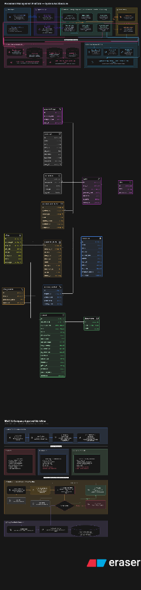

# Product Requirement Document (PRD) — CareerSync

## 1. Document Overview
**Project Name**: CareerSync  
**Version**: 1.0.0  
**Purpose**: Comprehensive platform for streamlining college placement drive management, corporate partner relationships, student eligibility tracking, offer generation, and AI-powered Job Description (JD) parsing with ATS resume matching.

---

## 2. Target User Personas
1. **Admin (Placement Officer)**: Full administrative control to onboard companies, review approvals, create drives, audit system logs, toggle drive statuses, and export placed statistics.
2. **Placement Team (Student Coordinators)**: Ability to schedule drives, configure eligible departments, view student details, upload JDs, and check in placed candidates.
3. **Manager (Principal / Department HODs)**: Read-only directory inspect access, reports evaluation, and statistics review.
4. **Students**: Registration, profiles management, and drive apply portals (controlled via backend eligibility checks).

---

## 3. Core Modules & Functional Features

### 3.1 Corporate Partner Directory (Companies)
- **Onboarding & Approval**: Supports draft onboarding requests by coordinators, transitioning to `PENDING_APPROVAL`, `APPROVED`, or `REJECTED` by Admins.
- **Location Map Selector**: Integration with interactive maps (latitude/longitude coordinates selector) to locate office venues and fetch official Google Maps urls.
- **Soft-Delete Recycle Bin (Delete History)**: 
  - Soft-deleting a company hides the profile and its drives from standard directories.
  - Admins can view deleted companies inside a separate **Delete History** tab.
  - Admins can **Restore** profiles back to the active list or perform a **Permanent Purge**.
- **Excel History Export**: Admins can download the full history of deleted companies (`.xlsx`) including addresses, geolocations, industries, contact details, and deletion timestamps.

### 3.2 Placement Drive Lifecycle
- **Eligibility Checking**: Configurable CGPA thresholds, eligible departments, and backlog limits.
- **Drive Status Transitions**: Transition drive status dynamically between:
  - **Warm** (Upcoming)
  - **Hot** (Ongoing)
  - **Completed**
  - **Cancelled**
- **Reconciliation Engine**: Changing drive eligibility constraints (departments/CGPA) automatically synchronizes registered candidates (`DriveStudent`), adding newly eligible students and removing ineligible profiles.
- **Completion Selectivity List**:
  - Transitioning a drive to `Completed` opens a modal for base, highest, average, and lowest CTC input.
  - Placement teams can check off placed students using a table filtered reactively by **Search Input** (Name/Register No.) and **Department select dropdown**.
  - Generates official placed list downloads (`.xlsx`) directly from the detail drawer.

### 3.3 AI JD Parsing & Resume ATS Matching
- **JD Upload**: Supports PDF file uploads, size parsing, and interactive file previewers.
- **AI Extract**: Automated extraction of CTC, eligible departments, responsibilities, and required technical/soft skills from the JD.
- **ATS Match Score**: Computes matching scores for student profiles against the JD parameters, parsing technical match, education fit, and missing skills to rank candidates.

---

## 4. System Architecture & Workflows
The platform is designed as a decoupled two-tier architecture:
- **Backend API Server**: Node.js, Express, TypeScript, and Prisma ORM connecting to a PostgreSQL Database.
- **Frontend SPA**: React, Vite, Tailwind CSS, Lucide Icons, and SheetJS (`xlsx`) for client-side workbook generation.

### 4.1 System Design, ER Diagram & Approval Workflows
Below is the unified design architecture, database entity relationships (ER), and corporate approval workflow diagram:

🔗 **[Click here to view the Interactive Eraser Workspace Diagram](https://app.eraser.io/workspace/ERiyH15CUPU29vZhYVRQ?origin=share)**

---

## 5. Database Entity Models
1. **User / Role**: Handles RBAC authentication (`ADMIN`, `MANAGER`, `PLACEMENT_TEAM`).
2. **Company**: Corporate details, location map parameters, and soft-delete datetime fields.
3. **PlacementDrive**: Core drive parameters, package details, and eligibility criteria.
4. **Student**: Register number, department, CGPA, and backlog details.
5. **DriveStudent**: Many-to-many relationship linking drives to registered candidates, storing participation, selectivity, and ATS matching metrics.
6. **Offer**: Placed candidate package logs, job roles, and audit timestamps.
7. **AuditLog**: Fully tracks user logins, drive creates/updates, and company deletes for strict compliance auditing.
